# 🛠️ Sekarpura II Sistem Informasi

<div align="center">
  
  
  
  ### **A Laravel + MySQL app built for PT Angkasa Pura II (IT Non-Public Division).**  
Designed from real staff interviews to streamline internal operations: **Agenda (events & attachments)**, **Forum (threads, comments, likes, notifications)**, and **User/Role management**.
  
[](https://laravel.com/)
[](https://www.php.net/)
[](https://www.mysql.com/)
[](https://vitejs.dev/)
  
</div>

---

## ✨ Overview

> **My first professional internship project** to solve real problem at **PT Angkasa Pura II – IT Non-Public Division**.

Developed based on employee interviews and feedback. It has an attractive yet professional appearance. Team of 3 developers - I was responsible for database design and full-stack development of the agenda and user management modules.

## 🔧 Modules & Key Features

| 📦 Module | 🌟 Key Features | 📝 Description |
|:---------:|----------------|:---------------:|
| **📅 Agenda** <br> *(Events & Attachments)* | • Create, edit, delete events <br> • Drag-drop reschedule event <br> • Detailed event information view <br> • Upload, download, delete file attachments <br> • Today & upcoming agenda widgets <br> | Event management with file attachments |
| **🗣️ Forum** <br> *(Community Discussion)* | • Threaded discussion system <br> • Comments & likes interaction <br> • Real-time notifications to thread owners <br> • Status workflow (approved/pending/rejected) <br> • Search and filtering capabilities | Community forum with moderation |
| **👤 Users & Roles** <br> *(User Management)* | • Role-based access control mapping <br> • Profile customization (bio, image) <br> • User directory and listing <br> • Basic user management tools <br> • SSO integration ready <br> | User system with SSO support |

---

## 🛠️ Technology Stack

<div align="center">

### Backend


### Frontend


</div>

---

## 📸 Application Screenshots

> **Using Dummy Data of Banking Case Study with Admin, Manager, an Staff Roles**.

<details>
<summary>🖼️ <strong>Click to view application interface</strong></summary>

<br>

<div align="center">

### ✈️ Landing Page
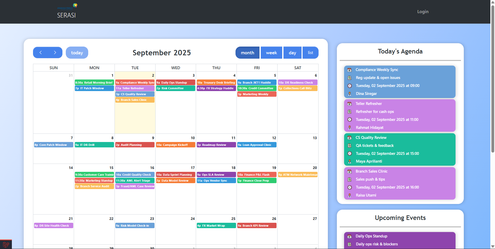

### 🔐 Authentication
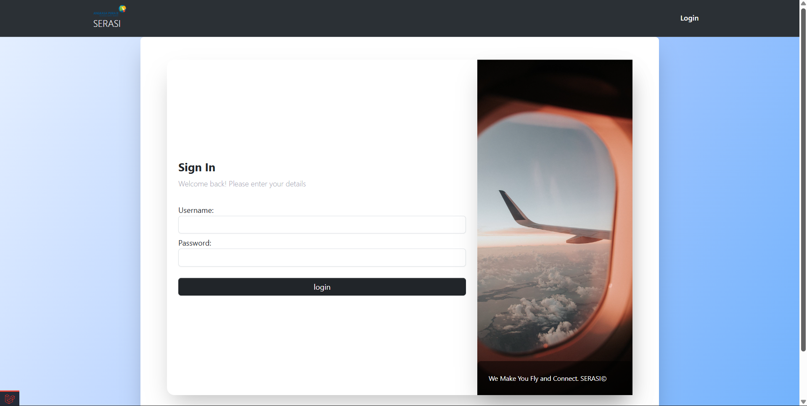

### 📊 Admin - Dashboard
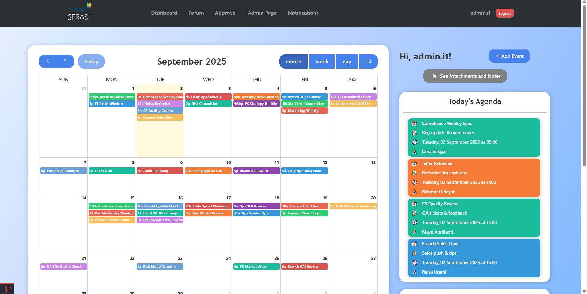

### 📊 Manager - Dashboard
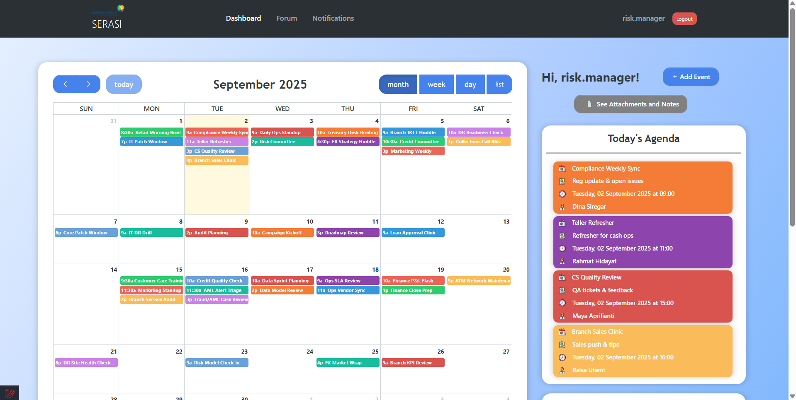

### 📊 Staff - Dashboard
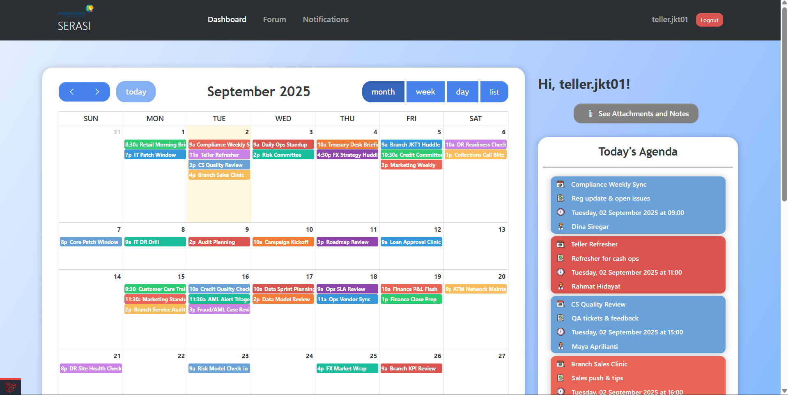

### 📋 Admin & Manager - Event Details
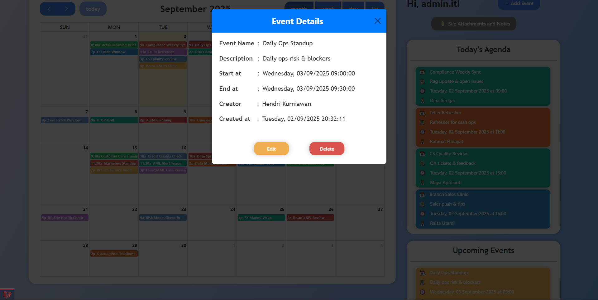

### 📋 Staff - Event Details
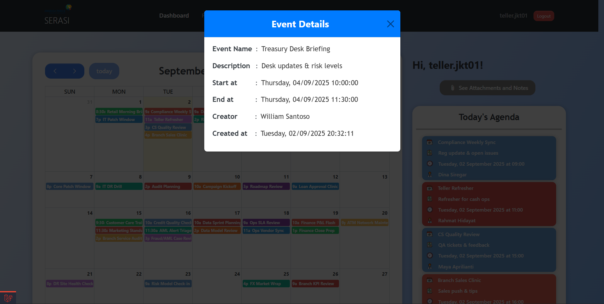

### ⏰ Admin & Manager - Add Event
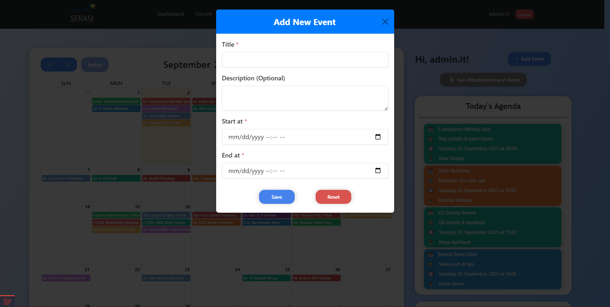

### 🔗 Admin & Manager - Attachments
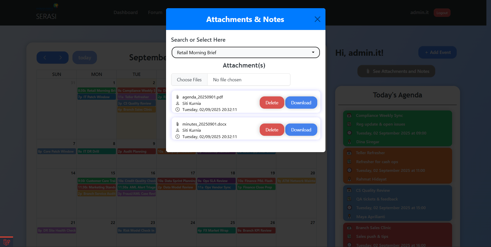

### 🔗 Staff - Attachments
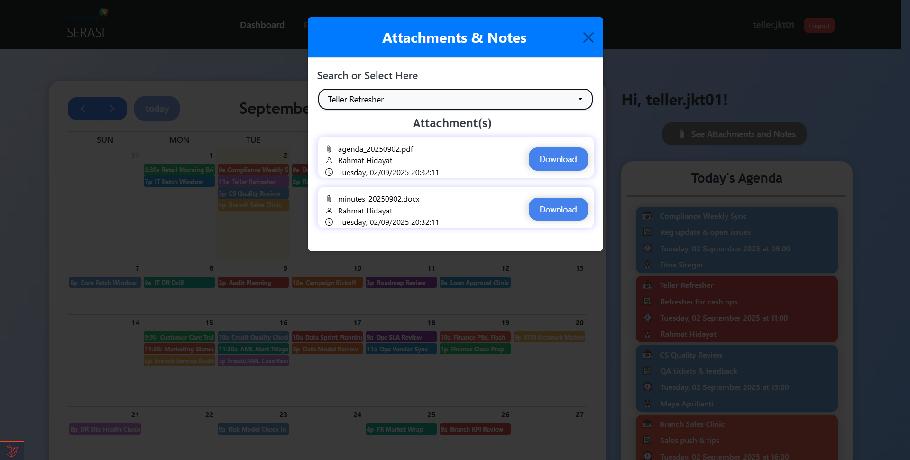

### 💭 Threads
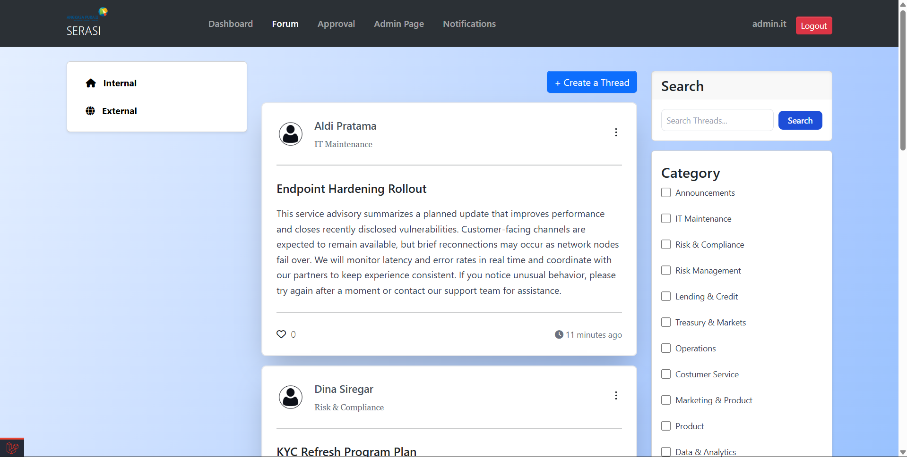

</div>

</details>

---

## 🚀 Quick Start Guide

### Prerequisites
- 🐘 **PHP 8.1+**
- 🎵 **Composer**
- 🗄️ **MySQL 8.0+**
- 📦 **Node.js & NPM**

### Installation

```bash
# 📥 Clone the repository
git clone https://github.com/bonifasiusbryan1/Simple-Student-Monitoring-System.git
cd Simple-Student-Monitoring-System

# 📦 Install dependencies
composer install && npm install

# ⚙️ Environment setup
cp .env.example .env
# Configure your database settings in .env

# 🗄️ Database setup
mysql -u root -p -e "CREATE DATABASE monitoring_mahasiswa;"
mysql -u root -p monitoring_mahasiswa < monitoring_mahasiswa.sql

# 🔑 Generate application key
php artisan key:generate

# 🔗 Create storage symlink
php artisan storage:link

# 🚀 Launch the application
php artisan serve
```

### 🌐 Access the Application
Open your browser and navigate to: `http://127.0.0.1:8000`

---

## 📂 Project Structure

```
Simple-Student-Monitoring-System/
├── 📁 app/                 # Application core files
├── 📁 database/            # Database migrations & seeds
├── 📁 public/              # Public assets & screenshots
├── 📁 resources/           # Views, CSS, JS resources
├── 📁 routes/              # Application routes
└── 📄 monitoring_mahasiswa.sql  # Database schema
```

</div>
